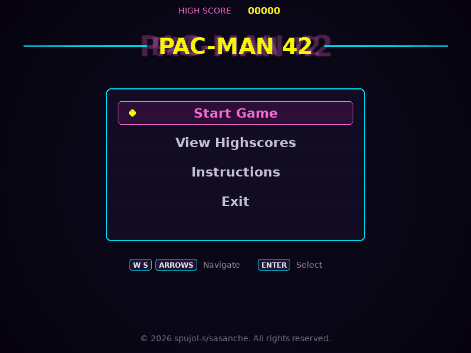
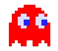

# Pac-Man 42

A from-scratch Pac-Man clone where every ghost hunts you differently, mazes are never the same twice, and nothing — not a corrupted config, not a hand-edited highscore file — can crash the game.




---

## Overview

The classic 1980 arcade game rebuilt in Python with a twist on how the work itself was organized: a two-person project split along the model/view boundary, where the only thing agreed on before writing any code was a fixed **entity contract** (`cell`, `px`/`py`, `direction`, `sprite_id`) in `src/states.py`. The simulation (`core/`, `entities/`) was built and tested as plain Python with zero Pygame imports while the UI, menus, config parsing and highscores were built in parallel on the other side of that contract.

Beyond faithful gameplay — buffered turns, ghost personalities, frightened-mode waves — the hard requirement driving half the design decisions was **zero tracebacks**: no malformed config, tampered highscore file, or maze-generator failure may ever produce a stack trace.

---

## Ghost AI

Each ghost inherits from an abstract `Ghost` base and defines its personality by implementing exactly one method — `_get_chase_target()`. Everything else (grid movement, direction choice by distance heuristic, respawn timers, speed per state) lives in the base class.

| | Ghost | Personality | Chase target |
|:---|:---|:---|:---|
|  | **Blinky** | Shadow | Pac-Man's exact cell — pure pursuit |
|  | **Pinky** | Ambusher | 4 cells ahead of Pac-Man's facing direction |
|  | **Inky** | wildcard | 2 cells ahead — cuts off escape routes |
|  | **Clyde** | shy | Chases when far, retreats to its corner within 8 cells |

Ghosts run a 4-state FSM (`CHASE / SCATTER / FRIGHTENED / EATEN`) on top of a shared wave timer: the level starts in `SCATTER` (7s), flips to `CHASE` (15s), and keeps alternating. A super-pacgum interrupts the wave — every ghost switches to `FRIGHTENED` for 8s, counted down independently, and each reverts to whatever the global state became in the meantime. When eaten, a ghost doesn't return to a central house: it heads back to **its own corner spawn** and respawns there after 5–10s.

Movement decisions only happen at cell-aligned intersections, and ghosts never reverse direction — matching the original arcade behavior.

---

## Architecture

```
pac-man.py ──► App (window, dt, application FSM, CRT overlay)
                    │
                    ▼
             states.py — GameState + the entity contract
                    │ (the only file both programmers had to agree on)
        ┌───────────┴────────────┐
        ▼                        ▼
  core/ + entities/        ui/ + systems/ + level_manager/
  simulation, zero Pygame  rendering, menus, persistence
  (plain Python, testable) (reads the model, never mutates it)
```

| Module | Responsibility |
|:---|:---|
| `core/game.py` | World state and `update(dt)`: wave/frightened timers, ghost collisions, eating, end conditions |
| `core/level.py` | Grid, spawns, collectible placement, level timer, win condition |
| `core/progression.py` | Level sequence (10 levels), persistent score/lives across levels |
| `entities/` | `Entity` → `MovingEntity` → `Player` / `Ghost` → `BlinkyGhost`, `PinkyGhost`, `InkyGhost`, `ClydeGhost` |
| `ui/play_screen.py` | In-game orchestration: input → simulation → renderer + HUD |
| `ui/renderer.py` | Neon maze (cached glow surface), sprites, collectible animation |
| `ui/menus/` | One file per screen, all inheriting `BaseScreen` (abstract `handle_event/update/draw`) |
| `ui/sprites.py` | Cached sprite bank + procedural chomp-frame generation |
| `systems/config_parser.py` | Self-healing Pydantic config loader |
| `systems/highscore.py` | Top-10 persistence with anti-tampering validation |
| `level_manager/maze_loader.py` | Adapter for the external A-Maze-ing generator |

---

## Key Technical Decisions

**Hybrid grid/pixel movement** — entities track a logical cell for decisions and a continuous `progress` (0.0–1.0) for rendering. All hard logic (collisions, AI, eating) reasons over the discrete grid; the screen shows smooth per-pixel motion. Chasing the same invariant in continuous coordinates would have made collision detection a floating-point nightmare.

**Delta time, clamped** — `dt = min(clock.tick(60) / 1000.0, 0.05)`. The clamp is not optional: without it, one lag spike produces an oversized `dt` that can tunnel an entity through a wall in a single frame.

**Input buffering** — a direction pressed before an intersection is queued and applied the moment it becomes legal. This is what makes controls feel responsive instead of frame-perfect, matching the arcade original.

**Maze walls as a bitmask** — each grid cell stores 4 wall bits (N/E/S/W). Traversability is one `&` operation, and the wall bitmask doubles as the rendering contract with the maze generator package.

**Self-healing config** — a Pydantic model validates every field with bounds; invalid values are discarded key-by-key (with a warning) and rebuilt from defaults instead of failing the whole file. A missing file, non-dict root, or corrupted JSON all land on safe defaults. There is no input path from config to traceback.

**Highscores that survive tampering** — every entry is validated on load (non-negative int score, 1–10 alphanumeric name). If the file is hand-edited into something invalid, the loader deletes it and returns an empty table rather than crashing the highscore screen — "never crash" won over "recover what we can".

**Fixed seed for level 1** — level 1 always uses seed 42 (configurable), so demos and testing are reproducible; levels 2+ are randomized. No two playthroughs past the first look the same.

---

## Visuals

Neon/synthwave restyling on top of classic Pac-Man sprites:

- **Glowing maze** — walls drawn with layered alpha passes, pre-rendered once per level onto a cached surface. The glow costs nothing per frame; it's a single blit.
- **Animated chomp** — Pac-Man's mouth frames (closed/mid/wide) are generated at runtime from the original sprite by polar-coordinate pixel analysis: any pixel inside the mouth's angular wedge gets filled or erased. No numpy, no external frames.
- **Frightened flash** — ghosts blink white during the last 2 seconds of frightened mode, like the arcade original.
- **CRT overlay** — scanlines plus radial vignette, pre-rendered once and blitted over every screen.
- **Arcade menu** — live top-score banner and an animated chase strip where the four ghosts pursue Pac-Man across the bottom of the main menu.

---

## Cheat Mode

Built for peer review, kept deliberately simple — flags checked inline where they matter, no second control layer:

| Key | Effect |
|:---|:---|
| `I` | Toggle invincibility (ghost collisions cost no lives) |
| `N` | Force-complete the current level |

---

## Configuration

`pac-man.py` takes exactly one argument: a JSON config file. `#`-comments are allowed despite not being valid JSON — they're stripped before parsing.

```json
{
    // "window": {"width": 1280, "height": 960, "fps": 60},
    "highscore_filename": "highscores.json",
    "lives": 3,
    "pacgum": 42,
    "points_per_pacgum": 10,
    "points_per_super_pacgum": 50,
    "points_per_ghost": 200,
    "seed": 42,
    "level_max_time": 100,
    "level": [
        {"width": 15, "height": 15},
        {"width": 20, "height": 15}
    ]
}
```

| Key | Meaning | Default |
|:---|:---|:---|
| `window` | Optional fixed window size/fps; omitted → auto-fit 80% of desktop, 4:3 | auto |
| `lives` | Starting lives | `3` |
| `pacgum` | Pacgums placed per level | `42` |
| `points_per_*` | Score per pacgum / super-pacgum / ghost | `10` / `50` / `200` |
| `seed` | Level 1 maze seed (levels 2+ randomize) | `42` |
| `level_max_time` | Seconds per level | `90` |
| `level` | Per-level maze dimensions (5–45 cells) | `21×21` |

Every value is clamped to sane bounds; unknown keys are ignored.

---

## Highscores

Top-10 persisted in a JSON file (`highscore_filename` in config, `highscores.json` by default), sorted descending on load and on every insert, truncated to 10 entries on save.

The design goal was surviving manual tampering, not just honest gameplay. Every entry is validated on load through a single guard: score must be a non-negative integer, name 1–10 characters (alphanumeric and spaces). If the file has been hand-edited into something invalid — or `json.load` fails outright — the loader deletes the corrupted file and returns an empty table instead of crashing the highscore screen. That trades "recover what we can" for "never crash", which given the project's zero-traceback requirement was the right side of the trade-off.

Name entry happens on the end screen (win or lose): 10-character input, defaults to `AAA` when submitted empty.

---

## Maze Generation

Mazes come from the external **A-Maze-ing** package assigned by another team, installed as-is from a bundled wheel and never modified — the loader (`maze_loader.py`) adapts to its interface, not the other way around. `PERFECT=False` is forced because a perfect maze (exactly one path between any two cells) leaves no loops, and without loops there's no escaping a cornered Pac-Man.

Dimensions are clamped to 5–45: below 5 the grid can't guarantee spawns, above 45 the generator's DFS recursion overflows.

---

## Installation & Usage

### Requirements

- Python 3.10+
- [`uv`](https://github.com/astral-sh/uv)

### Install & Run

```bash
make install      # uv sync + bundled maze-generator wheel
make run          # uv run python3 pac-man.py config.json
```

```bash
make debug        # under pdb
make lint         # flake8 + mypy
make lint-strict  # flake8 + mypy --strict
make clean        # remove caches and venv
```

### Controls

| Key | Action |
|:---|:---|
| `↑ ↓ ← →` / `W A S D` | Move (input is buffered) |
| `P` / `Esc` | Pause / resume |
| `Enter` / `Space` | Confirm menu selection |
| `I` / `N` | Cheat: invincibility / level skip |

---

## Project Structure

```
pacman/
├── pac-man.py                # Entry point (exactly 1 arg: config file)
├── config.json               # Example configuration
├── Makefile                  # install / run / debug / lint / clean
├── assets/                   # Sprites + demo GIF
├── project_management/       # Timeline, risks, team organization
└── src/
    ├── app.py                # Window, main loop, app FSM, CRT overlay
    ├── states.py             # GameState enum + entity contract
    ├── core/                 # Simulation — zero Pygame
    │   ├── game.py           # update(dt), waves, collisions, scoring
    │   ├── level.py          # Grid, spawns, collectibles, timer
    │   └── progression.py    # Level sequence, persistent score/lives
    ├── entities/
    │   ├── entity.py         # Entity → MovingEntity → Collectible
    │   ├── player.py         # Buffered input, lives, cheat flag
    │   ├── ghost.py          # Ghost FSM + 4 personality subclasses
    │   └── collectibles.py   # Pacgum, SuperPacgum
    ├── level_manager/
    │   └── maze_loader.py    # Adapter for the A-Maze-ing wheel
    ├── systems/
    │   ├── config_parser.py  # Self-healing Pydantic config
    │   └── highscore.py      # Top-10 persistence + validation
    └── ui/
        ├── play_screen.py    # In-game orchestration
        ├── renderer.py       # Neon maze, sprites, animation
        ├── sprites.py        # Cached sprite bank
        ├── hud.py            # Score / lives / level / timer
        ├── input_handler.py  # Keys → Directions
        └── menus/            # One screen per file, shared BaseScreen
```

---

## Project Management

Work was split by ownership rather than tickets: one programmer owned the simulation (`core/`, `entities/`), the other owned UI and data (`ui/`, `systems/`, `level_manager/`). The entity contract in `states.py` was written before anything else specifically so both halves could be built in parallel without merge conflicts on shared logic.

Four phases, each ending with an integration checkpoint: contract & skeleton → vertical slice (player moving on a real maze) → playable core (ghosts, collisions, rendering) → systems & polish (menus, highscores, packaging). Timeline, risk analysis, and team organization notes live in [`project_management/`](project_management/).

---

## Resources

### References

- [Pygame documentation](https://www.pygame.org/docs/)
- [Understanding Pac-Man ghost behavior](https://gameinternals.com/understanding-pac-man-ghost-behavior)
- [Fix Your Timestep! — Gaffer On Games](https://gafferongames.com/post/fix_your_timestep/)
- [Game Programming Patterns — State](https://gameprogrammingpatterns.com/state.html)

### AI usage

AI was used as a Socratic mentor to validate architectural decisions, for SOLID-oriented refactoring feedback (behavior verified unchanged against a deterministic simulation baseline), and to help structure this documentation. All final code and design decisions were reviewed, tested, and are fully understood by the authors.
